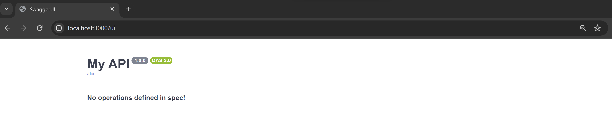

# Integrate Hono with Openapi/Swagger

I like to write web application using typescript, Because of typesafety. You can make sure what api your frontend call it's suitable with what your backend serve.Library like [TRPC](https://trpc.io/) prove that it can be done. Moreover typescript(javascript) not only can build web application, it can also build mobile app (react native) and desktop (electron, tauri, wails), so you can apply typesafety on different client as well.

But not everything were written in typescript. For example you have a mobile developer who write app in Native language (Kotlin, Java, Swift) or using different framework like Flutter. Maybe you want to create webhook so you cannot use specific language feature.

One of standard that integrate "typesafety" accross programing language is [openapi(swagger)](https://www.openapis.org/). In this tutorial we will integrate [Hono](https://hono.dev/) webframework with Openapi.

## Requirement and Installation

### Requirement
- Node >= 20
- npm or yarn or pnpm

### Instalation
1. we gonna use hono nodejs quick start template [hono quickstart](https://hono.dev/top#quick-start)
```bash
npm create hono@latest
# or
yarn create hono
# or
pnpm create hono
```
for target directory We will named it hono-openapi then choose nodejs as template.


1. Go to target directory then Install depedencies.
```bash
npm install
# or 
yarn install
# or
pnpm install
```

## Setup Openapi and Swagger
1. Add depedencies for openapi and swagger
```bash
npm install zod @hono/zod-openapi @hono/swagger-ui
# or 
yarn install zod @hono/zod-openapi @hono/swagger-ui
# or
pnpm install zod @hono/zod-openapi @hono/swagger-ui
```

2. Replace src/index.ts
```ts
import { serve } from "@hono/node-server";
import { swaggerUI } from "@hono/swagger-ui";
import { OpenAPIHono } from "@hono/zod-openapi";

const app = new OpenAPIHono();

// The openapi.json will be available at /doc
app.doc("/doc", {
	openapi: "3.0.0",
	info: {
		version: "1.0.0",
		title: "My API",
	},
});

// swagger ui doc will be available at {server url}/ui
// fell free to change the url
// swaggerUI url must have same path as openapi.json
app.get("/ui", swaggerUI({ url: "/doc" }));

const port = 3000;
console.log(`Server is running on port ${port}`);

serve({
	fetch: app.fetch,
	port,
});

```

3. Your swagger doc will be available at [http://localhost:3000/ui](http://localhost:3000/ui) 

## Basic Route
let's create hello world route, a simple route that just return json with key "hello" and value "world".
```ts
import { serve } from "@hono/node-server";
import { swaggerUI } from "@hono/swagger-ui";
import { OpenAPIHono, createRoute } from "@hono/zod-openapi"; // <- add createRoute
import { z } from "zod"; // <- add zod

const app = new OpenAPIHono();

// The openapi.json will be available at /doc
app.doc("/doc", {
	openapi: "3.0.0",
	info: {
		version: "1.0.0",
		title: "My API",
	},
});

// basic route
// ------ added code -------
const basicRoute = createRoute({
	method: "get",
	path: "/basic/",
	responses: {
		200: {
			content: {
				"application/json": {
					schema: z.object({
						hello: z.string(),
					}),
				},
			},
			description: "say hello",
		},
	},
});

app.openapi(basicRoute, (c) => {
	return c.json({ hello: "world" }, 200);
});
// ------ end added code -------

// swagger ui doc will be available at {server url}/ui
// fell free to change the url
// swaggerUI url must have same path as openapi.json
app.get("/ui", swaggerUI({ url: "/doc" }));

const port = 3000;
console.log(`Server is running on port ${port}`);

serve({
	fetch: app.fetch,
	port,
});

```
app.openapi receive 2 parameter schema and route. schema is where you put your openapi definition while route is basic hono api route. Route documentation will shown at swagger UI below


## Code Spliting
When your app grow larger, You don't want all your route in index.ts. You want to split it in other file or folder. This is how you split route on diffrent file. Create file foo.ts then add this code.
```ts
// src/foo.ts
import { OpenAPIHono, createRoute } from "@hono/zod-openapi";
import { z } from "zod";

export const app = new OpenAPIHono();

const fooRoute = createRoute({
	method: "get",
	path: "/other/",
	responses: {
		200: {
			content: {
				"application/json": {
					schema: z.object({
						foo: z.string(),
					}),
				},
			},
			description: "foo response",
		},
	},
	tags: ["Foo"], // <- Add tag here
});

app.openapi(fooRoute, (c) => {
	return c.json({ foo: "hello foo" }, 200);
});

```
then import it on your index.ts.

```ts
// src/index.ts
import { serve } from "@hono/node-server";
import { swaggerUI } from "@hono/swagger-ui";
import { OpenAPIHono, createRoute } from "@hono/zod-openapi";
import { z } from "zod";
import { app as appFoo } from "./foo"; // <- import route here

const app = new OpenAPIHono();
app.route("/foo", appFoo); // <- add imported route here

// The openapi.json will be available at /doc
app.doc("/doc", {
	openapi: "3.0.0",
	info: {
		version: "1.0.0",
		title: "My API",
	},
});

// rest of code
// ...
```
It will shown add your swagger UI like this.

all imported route will be prefixed with "/foo".

## Cheat sheat
These are some use case example:

### Path and Query 
Params and query can only be string. If it's not string hono will return never on c.req.valid("query"). If you want type other than string at type on openapi schema by adding key type, then do parsing and validation on route.
```ts
const pathAndQueryRoute = createRoute({
	method: "get",
	path: "/path-and-query/{id}",
	request: {
		query: z.object({
			a: z.string().openapi({
				param: {
					name: "a",
					in: "query",
				},
				type: "integer",
				example: "1",
			}),
			b: z
				.string()
				.optional()
				.openapi({
					param: {
						name: "b",
						in: "query",
						required: false,
					},
					type: "integer",
					example: "2",
				}),
		}),
		params: z.object({
			id: z.string().openapi({
				param: {
					name: "id",
					in: "path",
				},
				type: "integer", // <- you can still add type by adding key type
				example: "1",
			}),
		}),
	},
	responses: {
		200: {
			content: {
				"application/json": {
					schema: z.object({
						id: z.string(),
						a: z.string(),
						b: z.string().nullable().optional(),
					}),
				},
			},
			description: "Ok Response",
		},
	},
});

app.openapi(pathAndQueryRoute, (c) => {
	const { id } = c.req.valid("param");
	const { a, b } = c.req.valid("query");
	return c.json({ id, a, b: b || null }, 200);
});
```

### Form Data
```ts
const formDataRoute = createRoute({
	method: "post",
	path: "/form-data/",
	request: {
		body: {
			content: {
				"multipart/form-data": {
					schema: z
						.object({
							foo: z.string(),
							bar: z.string(),
							image: z.instanceof(File).or(z.string()).openapi({
								type: "string",
								format: "binary",
							}),
						})
						.openapi({
							required: ["foo"],
						}),
				},
			},
		},
	},
	responses: {
		200: {
			content: {
				"application/json": {
					schema: z.object({
						foo: z.string(),
						bar: z.string().nullable(),
						image: z.string().nullable(),
					}),
				},
			},
			description: "form data ok response",
		},
	},
});

app.openapi(formDataRoute, (c) => {
	const { foo, bar, image } = c.req.valid("form");

	if (image instanceof File) {
		// save file code here
	}

	return c.json(
		{
			foo,
			bar,
			image: image instanceof File ? image.name : null,
		},
		200,
	);
});
```

### Form Data Multiple
```ts
const formMultipleRoute = createRoute({
	method: "post",
	path: "/form-data-multiple/",
	request: {
		body: {
			content: {
				"multipart/form-data": {
					schema: z.object({
						arrStr: z.string().openapi({
							type: "array",
							items: {
								type: "string",
							},
						}),
						arrFile: z
							.instanceof(File)
							.or(z.string())
							.openapi({
								type: "array",
								items: {
									type: "string",
									format: "binary",
								},
							}),
					}),
				},
			},
		},
	},
	responses: {
		200: {
			content: {
				"application/json": {
					schema: z.object({
						arrStr: z.array(z.string()),
						arrFile: z.array(z.string()),
					}),
				},
			},
			description: "form data ok response",
		},
	},
});

app.openapi(formMultipleRoute, async (c) => {
	// c.req.valid not working on array form
	const formData = await c.req.formData();

	// Get array string
	const strs = formData.getAll("arrStr");
	const arrStr: string[] = [];
	for (const item of strs) {
		if (typeof item === "string") {
			arrStr.push(item);
		}
	}

	// Get array file
	const files = formData.getAll("arrFile");
	const arrFile: string[] = [];
	for (const file of files) {
		if (file instanceof File) {
			// save file code here
			arrFile.push(file.name);
		}
	}

	return c.json(
		{
			arrStr,
			arrFile,
		},
		200,
	);
});

```

### Download File
```ts
import path = require("node:path");
import { readFileSync } from "node:fs";

const downloadFileRoute = createRoute({
	method: "get",
	path: "/download-file/",
	summary: "download file",
	request: {
		query: z.object({
			contentType: z
				.union([z.literal("image/png"), z.literal("application/octet-stream")])
				.default("image/png"),
		}),
	},
	responses: {
		200: {
			content: {
				"image/png": {
					schema: z.any().openapi({
						type: "object",
						format: "binary",
					}),
				},
				"application/octet-stream": {
					schema: z.any().openapi({
						type: "object",
						format: "binary",
					}),
				},
			},
			description:
				"Return file, contentType can be image/png or application/octet-stream",
		},
	},
});

// disable ts check because hono openapi cannot validate raw response
// @ts-ignore: Unreachable code error
app.openapi(downloadFileRoute, async (c) => {
	const { contentType } = await c.req.valid("query");
	const payload = readFileSync(path.join("static", "Wikipedia-logo.png"));
	if (contentType === "image/png") {
		return new Response(payload, {
			headers: {
				"content-type": "image/png",
			},
			status: 200,
		});
	} else {
		return new Response(payload, {
			headers: {
				"content-type": "application/octet-stream",
				"Content-Disposition": 'attachment; filename="wikipedia.png"',
			},
			status: 200,
		});
	}
});
```

### Security (Authorization Api Key)
```ts
// Register security scheme
// add it on your index.ts
app.openAPIRegistry.registerComponent(
	"securitySchemes",
	"AuthorizationApiKey", // <- Add security name
	{
		type: "apiKey",
		name: "X-API-KEY",
		in: "header",
	},
);

const protectedApiKeyRoute = createRoute({
	method: "get",
	path: "/protected-api-key/",
	summary: "Protected api-key Example",
	security: [
		{
			AuthorizationApiKey: [], // <- Add security name (must be same)
		},
	],
	request: {
		headers: z.object({
			"x-api-key": z.string().optional(),
		}),
	},
	responses: {
		200: {
			content: {
				"application/json": {
					schema: z.object({
						message: z.string(),
					}),
				},
			},
			description: "Authorized Response",
		},
		401: {
			content: {
				"application/json": {
					schema: z.object({
						error: z.string(),
					}),
				},
			},
			description: "Unauthorized Response",
		},
	},
	tags: ["Examples"],
});

app.openapi(protectedApiKeyRoute, (c) => {
	const { "x-api-key": apiKey } = c.req.valid("header");
	// or
	console.log(c.req.header()["x-api-key"]);
	if (apiKey) {
		return c.json(
			{
				message: "Hello",
			},
			200,
		);
	}
	return c.json(
		{
			error: "Unauthorized",
		},
		401,
	);
});
``` 

### Security (Bearer)
```ts
// Security (Bearer)
// Register security scheme
// add it on your index.ts
app.openAPIRegistry.registerComponent(
	"securitySchemes",
	"AuthorizationBearer", // <- Add security name
	{
		type: "http",
		scheme: "bearer",
		bearerFormat: "JWT",
	},
);

export const protectedBearerRoute = createRoute({
	method: "get",
	path: "/protected-bearer/",
	summary: "Protected bearer Route Example",
	security: [
		{
			AuthorizationBearer: [], // <- Add security name (must be same)
		},
	],
	request: {
		headers: z.object({
			authorization: z.string().optional(),
		}),
	},
	responses: {
		200: {
			content: {
				"application/json": {
					schema: z.object({
						message: z.string(),
					}),
				},
			},
			description: "Authorized Response",
		},
		401: {
			content: {
				"application/json": {
					schema: z.object({
						error: z.string(),
					}),
				},
			},
			description: "Unauthorized Response",
		},
	},
});

app.openapi(protectedBearerRoute, (c) => {
	const { authorization } = c.req.valid("header");
	// or
	console.log(c.req.header()["authorization"]);
	if (authorization) {
		return c.json(
			{
				message: "Hello",
			},
			200,
		);
	}
	return c.json(
		{
			error: "Unauthorized",
		},
		401,
	);
});
```

That's all guys. Full source code are availble on github repo [](). I hope it can help you integrate hono with openapi/swagger. If I found something new, incorrect or out of date, I'll try to revised this post. If you have any question or found something wrong feel free to ask on the comment section. Cheers.
